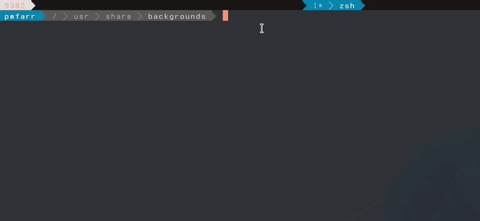

# Colors

## What it Does

This application is not finished being built yet. It currently will take an
image file, analyze the 8 primary (most used) colors in it and give that to you
in the terminal as colors blocks.

## How to use it

You use it like such `colors image.jpg`. See the associated gif:

## TODOS

1. Saturate colors so they are more pleasing before giving back
2. Compile this down to WASM for a website that provides users with color codes.
